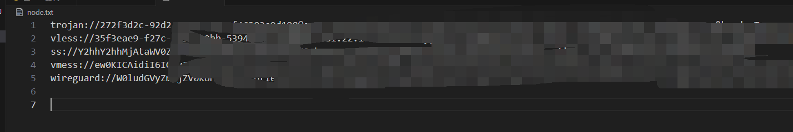

# xray config生成脚本，可根据v2ray格式的多个节点，生成xray的多出口多入口配置文件，个人主要于爬虫使用

## 用法
### 0. 安装python3(略)
### 1. 将v2ray格式的节点复制到`node.txt`文件中!
大概长这样

### 2. 运行脚本
```shell
python __main__.py
```
### 3. 生成的配置文件在同级目录下的`config.json`中
### 4. 下载[xray-core](https://github.com/xtls/Xray-core/releases)
### 5. 将config.json移动到xray同级目录
### 6. xray启动